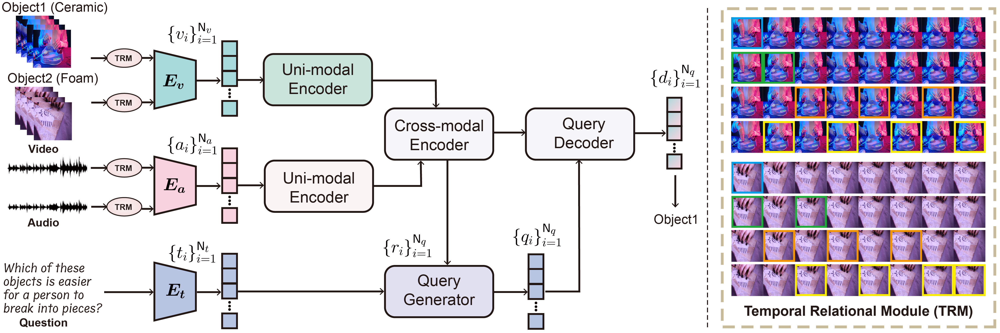

# MCoMet: Multimodal Fusion Transformer for Physical Audiovisual Commonsense Reasoning

This repository maintains the official implementation of the paper [MCoMet: Multimodal Fusion Transformer for Physical Audiovisual Commonsense Reasoning](https://arxiv.org/). 


<p align="center"></p>


## Installation
The runtime environment relies on the following packages

- CUDA 11.5.0
- CUDNN 8.3.2.44
- Python 3.10.0
- PyTorch 1.11.0
- [NNCore](https://github.com/yeliudev/nncore) 0.3.6


### Install from source

1. Clone the current repository 
``` 
git clone xxx.git
```

Please refer to the following environmental settings, and we recommend creating an Anaconda environment.


```bash
conda create --name mcomet python=3.8.11
conda activate mcomet
```

2. Install dependencies.
```bash
pip install -r requirements.txt
```

Then, install the correct version of PyTorch, based on your cuda version [here](https://pytorch.org/get-started/locally/). For example:

```
pip3 install torch==1.11.0+cu113 torchvision==0.12.0+cu113 torchaudio==0.11.0+cu113 -f https://download.pytorch.org/whl/cu113/torch_stable.html
```

## Getting Started

### Download and Prepare the Datasets

1. Download and prepare the datasets.

- [PACS](https://drive.google.com/drive/folders/1TjOKBTU9dsytHJIb919V4wXFR1Zm5TsJ?usp=sharing)

Alternatively, if you want to replicate the original download steps, you can run the following code (this will take a while):
```
cd dataset/scripts
python3 download.py -data_dir PATH_TO_DATA_STORAGE_HERE
python3 preprocess.py -data_dir PATH_TO_DATA_STORAGE_HERE
```
### Train and Test a model
To run and evaluate the models, please refer to the training recipes for each baseline model in the `models` folder.

### Model Zoo

We provided model results here.

| **Model**                                                                                     | **With Audio (%)** | **Without Audio (%)** | **Δ** |
|-----------------------------------------------------------------------------------------------|:--------------------:|:-----------------------:|:--------------:|
| Fusion (I+A+V)                                                                                | 51.9 ± 1.1     | -                     | -            |
| Fusion (Q+I)                                                                                  | -                  | 51.2 ± 0.8        | -            |
| Fusion (Q+A)                                                                                  | 50.9 ± 0.6     | -                     | -            |
| Fusion (Q+V)                                                                                  | -                  | 51.5 ± 0.9        | -            |
| Late Fusion                                                                                   | 55.0 ± 1.1     | 52.5± 1.6         | 2.5          |
| [CLIP](https://github.com/openai/CLIP)/[AudioCLIP](https://github.com/AndreyGuzhov/AudioCLIP) | 60.0 ± 0.9     | 56.3 ± 0.7        | 3.7          |
| [UNITER](https://github.com/ChenRocks/UNITER) (L)                                             | -                  | 60.6 ± 2.2        | -            |
| [Merlot Reserve](https://github.com/rowanz/merlot_reserve) (B)                                | 66.5 ± 1.4     | 64.0 ± 0.9        | 2.6          |
| [Merlot Reserve](https://github.com/rowanz/merlot_reserve) (L)                                | 70.1 ± 1.0     | 68.4 ± 0.7        | 1.8          |
| [MCoMeT(C={1})](https://github.com/anonymous)                                                  | 75.9 ± 0.6     | 71.6 ± 0.1        | 4.3          |
| [MCoMeT(C={2,3})](https://github.com/anonymous)                                                | 79.7 ± 1.1     | 75.2 ± 0.9        | 4.5          |
| Human                                                                                         | 96.3 ± 2.1     | 90.5 ± 3.1        | 5.9          |